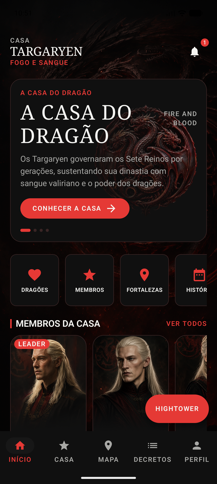
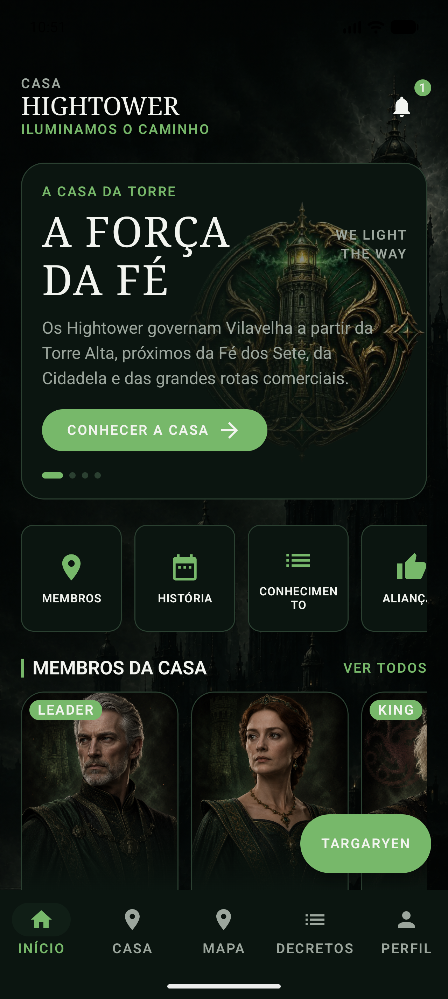

# Realm Compose UI

**Um app Android onde a mesma tela vira duas casas diferentes — sem release, sem deploy, só payload.**

Projeto de estudo de **Server Driven UI (SDUI)** com Jetpack Compose. O app não conhece
nenhuma tela: ele só sabe interpretar componentes que o servidor descreve. Trocar da casa
Targaryen para a Hightower recarrega tema, textos, atalhos, membros, notícias e até os itens
da barra inferior — tudo vindo do backend.

<table>
  <tr>
    <td width="50%"></td>
    <td width="50%"></td>
  </tr>
  <tr>
    <td align="center"><b>Casa Targaryen</b><br/><sub>payload <code>house-home-targaryen</code></sub></td>
    <td align="center"><b>Casa Hightower</b><br/><sub>payload <code>house-home-hightower</code></sub></td>
  </tr>
</table>

> As duas telas são **o mesmo composable**. Nenhum `if (house == "targaryen")` no código.

---

## O que é Server Driven UI

Em um app tradicional, o layout mora no cliente: mudar a ordem de dois componentes exige PR,
build, revisão da loja e adoção do usuário. Duas semanas para mover um card.

Em SDUI, o servidor descreve **quais componentes existem, em que ordem, com quais cores,
textos e ações**. O app vira um interpretador. A mudança chega em minutos — inclusive para
quem está numa versão antiga do app.

```
GET /sdui?screen=house_home&house=targaryen
```

```
payload → { analytics, theme, screen, components[] }
component → { id, type, visible, props }
action → { type, route?, enabled }
```

---

## Como foi implementado

### O contrato acima de tudo

O risco de SDUI não é a UI, é o payload malformado em produção. Cinco invariantes seguram o app:

| # | Situação | Comportamento |
| --- | --- | --- |
| 1 | `type` desconhecido | Componente ignorado com log — **o resto da tela renderiza** |
| 2 | Campo obrigatório ausente | Descarta o componente, nunca a tela |
| 3 | `enabled: false` | Desabilita a interação, mas o item continua visível |
| 4 | `visible: false` | Remove o componente da composição |
| 5 | Payload fora do schema suportado | Cai em fallback tratado, jamais em crash |

Isso é o que permite o servidor publicar um componente novo amanhã sem quebrar versões antigas.

### Parsing puro, fora do Compose

`SduiPayloadParser` é um `object` puro sobre `Map<String, Any?>` que devolve uma hierarquia
selada. O composable recebe **modelo tipado, nunca JSON solto**.

Resultado prático: os testes do parser rodam como teste JVM comum — sem emulador, sem
Robolectric, em milissegundos.

### Tema 100% do servidor

Cores, tipografia, raios de canto, espaçamentos e imagem de fundo vêm do payload. O design
system define apenas o *formato* dos tokens e o fallback — **jamais a paleta de uma casa**.

```kotlin
RealmSduiTheme(theme = state.theme) { /* MaterialTheme montado em runtime */ }
```

### Ação é dado, nunca código

```json
{ "type": "navigate", "route": "/house/hightower", "enabled": true }
```

O app mapeia `type` → handler registrado. Rota do servidor vira destino local em
`RealmRoute.fromSduiRoute`; rota sem destino (`/characters/...`) devolve `null` e vira
snackbar — **nunca navegação errada**.

### A barra inferior também é SDUI

Rótulo, ícone, ordem e habilitação vêm do componente `bottomNavigation`. Sem payload, um
`fallbackItems()` mantém o app navegável. Adicionar um item novo é editar `db.json`.

---

## Stack

| Camada | Tecnologia |
| --- | --- |
| **UI** | Jetpack Compose · Material 3 · Navigation Compose |
| **Imagens** | Coil 3 |
| **Rede** | Retrofit · OkHttp · Moshi |
| **DI** | Koin |
| **Assíncrono** | Coroutines · StateFlow |
| **Build** | Gradle convention plugins em included build · version catalog |
| **Testes** | JUnit (parser e navegação, sem emulador) |
| **Backend de estudo** | json-server servindo `db.json` + assets estáticos |

`compileSdk` 37.1 · `minSdk` 24 · Java 11 · Kotlin 2.1

---

## Arquitetura

Três módulos Gradle, sem submódulos, mais um included build para a configuração.

```
:app       → Application, Activity e grafo Koin. Não conhece componente SDUI nenhum.
:feature   → Navegação e telas. Um composable por `type` do payload.
:core      → Modelo, parser, rede, repositório e design system.
build-logic → Convention plugins: todo `android { }` mora aqui.
```

**Regra de dependência:** `app → feature → core`. `core` nunca enxerga `feature`.

O modelo de domínio não conhece Android: cor é `String` hex, e quem converte para `Color`
é o design system. Isso mantém o parser testável fora do framework.

### Convention plugins

Módulo declara **o que é**, não como se configura:

```kotlin
plugins {
    id("realm.android.library")
    id("realm.android.compose")
    id("realm.android.network")
    id("realm.android.di")
}
```

Nenhuma configuração de SDK, Java, flavor ou buildType espalhada pelos módulos.

---

## Rodando o projeto

**1. Suba o backend** (serve o payload e os assets):

```bash
npx json-server db.json --static ./public
```

**2. Instale o app:**

```bash
./gradlew :app:installDevDebug
```

O emulador acessa a máquina host via `http://10.0.2.2:3000/`. Cleartext HTTP é liberado
apenas no buildType `debug`.

**Endpoints:**

| Rota | Uso |
| --- | --- |
| `GET /appConfig` | Bootstrap: tela e casa padrão, schemas e layouts suportados |
| `GET /sdui?screen=house_home&house=targaryen` | Payload da tela |

**Testes:**

```bash
./gradlew :core:testDebugUnitTest :feature:testDebugUnitTest
```

---

## Explorando

Alguns experimentos que mostram o contrato funcionando:

- **Troque a paleta**: mude `theme.colors.primary` no `db.json` e recarregue o app pelo FAB.
- **Reordene a tela**: mova um objeto dentro de `components[]`.
- **Esconda um componente**: `"visible": false`.
- **Quebre de propósito**: mude um `type` para `"hologram"` — o componente some, a tela continua.
- **Adicione um membro**: um objeto novo em `horizontalCarousel.props.items`.

Nenhum desses exige recompilar o app.

---

## O que este projeto demonstra

- Desenho de **contrato entre cliente e servidor** com compatibilidade retroativa
- **Modularização** com fronteiras explícitas e configuração centralizada
- **Lógica testável isolada do framework** de UI
- Degradação **graciosa** diante de dado inesperado
- Compose além do CRUD: tema dinâmico, interpretação de árvore de componentes e navegação orientada a dados
